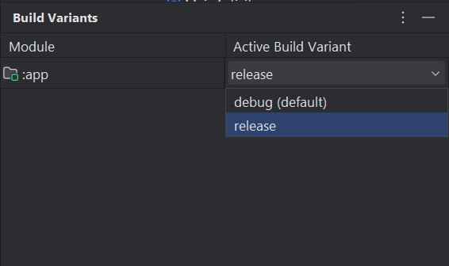
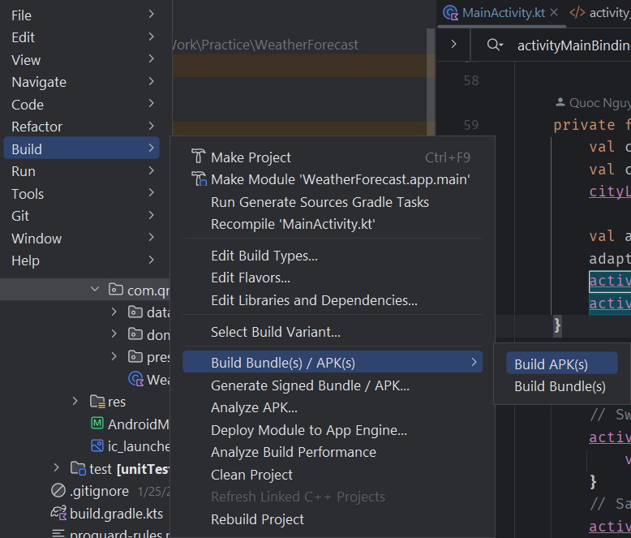
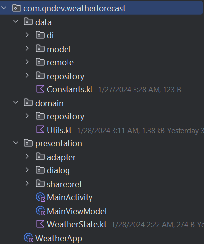
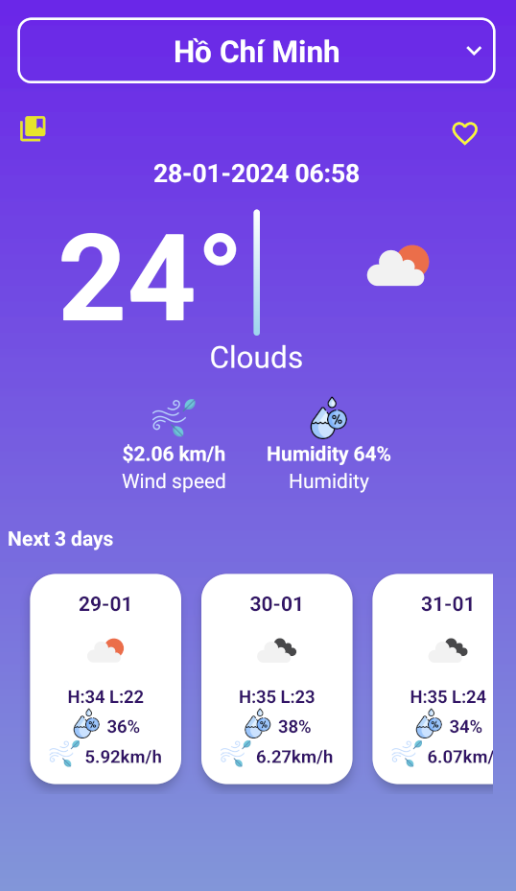
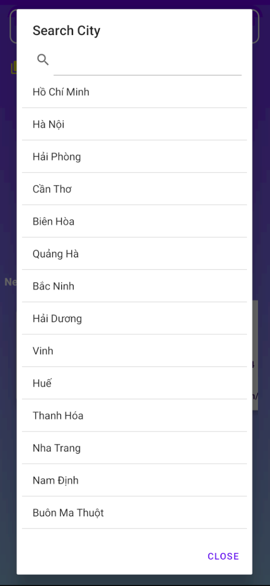

# Weather App

A weather android app with Clean Architecture

## Instruction
* Select variant before build.

* Option 1: Connect your device and build.

* Option 2: Create APK file and install on device.

## Architecture
* Code is written with Clean Architecture.

* **Data layer** contains model and api config to get data from remote.
* **Domain layer** contains Repository methods to communicate with **Data layer**.
* **Presentation layer** using **MVVM** contain views and **ViewModel**.

## Dependencies
* [Coil](https://coil-kt.github.io/coil/): An image loading library for Android backed by Kotlin Coroutines.
* [Hilt](https://developer.android.com/training/dependency-injection/hilt-android): For dependency injection.
* [Retrofit](https://github.com/square/retrofit): Handle API.
* [OkHttp](https://square.github.io/okhttp/): For logging interceptor.
* [Coroutines](https://developer.android.com/kotlin/coroutines): For asynchronous task.

## Screenshot

 
